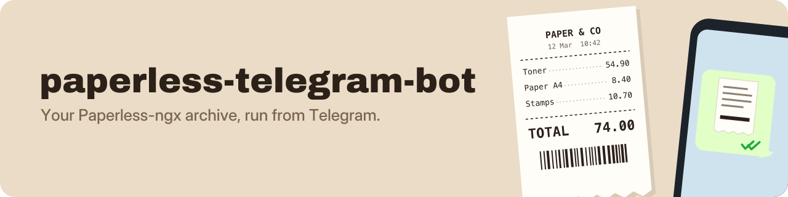

---
hide:
  - navigation
  - toc
---

# paperless-telegram-bot { .ptb-visually-hidden }

<p align="center">
  
</p>

<p align="center">
  <a href="https://hub.docker.com/r/drumsergio/paperless-telegram-bot"></a>
  <a href="https://github.com/GeiserX/paperless-telegram-bot/stargazers"></a>
  <a href="https://github.com/GeiserX/paperless-telegram-bot/releases"></a>
  <a href="https://github.com/GeiserX/paperless-telegram-bot/blob/main/LICENSE"></a>
</p>

---

**paperless-telegram-bot** is a Telegram bot for [Paperless-ngx](https://docs.paperless-ngx.com/), run in Docker. Send a photo or a file from your phone and it lands in your archive; then tag it, file it, search it and get it back, all from the chat. The bot polls Telegram and talks to Paperless over its API, so it needs no public URL, no open port and no VPN on the phone, and Paperless can stay on your LAN. Start with [Getting started](getting-started.md), then [Usage](usage.md).

<div class="grid cards" markdown>

-   :material-docker: **[Getting started](getting-started.md)**

    ---

    Get the three values (bot token, Paperless token, your user id), then run the image or install from source.

-   :material-play-circle-outline: **[What a working start looks like](getting-started.md#what-a-working-start-looks-like)**

    ---

    The six log lines of a good start, the reply to `/start`, and the health check.

-   :material-chat-outline: **[Usage](usage.md)**

    ---

    Upload, tag, search, download and clear the inbox, all from the chat.

-   :material-format-list-bulleted: **[Configuration](configuration.md)**

    ---

    Every environment variable, its default, and the security notes.

</div>

## Quick start

=== "Docker"

    ```bash
    docker run -d --name paperless-telegram-bot --restart unless-stopped \
      -e TELEGRAM_BOT_TOKEN=your_bot_token \
      -e PAPERLESS_URL=http://paperless.home:8000 \
      -e PAPERLESS_TOKEN=your_paperless_api_token \
      -e TELEGRAM_ALLOWED_USERS=123456789 \
      drumsergio/paperless-telegram-bot:v0.7.0
    ```

    The image is amd64 only. On arm64, use the From source tab.

=== "Docker Compose"

    ```yaml
    services:
      paperless-telegram-bot:
        image: drumsergio/paperless-telegram-bot:v0.7.0
        container_name: paperless-telegram-bot
        restart: unless-stopped
        environment:
          TELEGRAM_BOT_TOKEN: "${TELEGRAM_BOT_TOKEN}"
          PAPERLESS_URL: "http://paperless:8000"
          PAPERLESS_TOKEN: "${PAPERLESS_TOKEN}"
          TELEGRAM_ALLOWED_USERS: "${TELEGRAM_ALLOWED_USERS}"
    ```

    Put it next to a `.env` holding the three secrets; [Docker Compose](getting-started.md#docker-compose) has the health check and where `.env` comes from.

=== "From source"

    ```bash
    git clone https://github.com/GeiserX/paperless-telegram-bot.git
    cd paperless-telegram-bot
    python -m venv .venv && . .venv/bin/activate
    pip install -e .
    cp .env.example .env   # then fill in the four values
    paperless-bot run
    ```

    Python 3.11 or newer. The 0.7.0 package on PyPI is missing modules, so this is the path until the next release; see [From source](getting-started.md#from-source).

Get the three values first: the bot token from [@BotFather](https://t.me/BotFather), the Paperless API token from your Paperless profile, and your own Telegram user id from [@userinfobot](https://t.me/userinfobot). [Before you start](getting-started.md#before-you-start) walks through each. `PAPERLESS_URL` is the address the bot can reach, which is not always the one in your browser. When it works the log ends with `Bot commands registered with Telegram`, and `/start` in the chat gets the command list back.

## What it does

- Send a photo or any file up to 20 MB (Telegram's limit for bots) and it is uploaded to Paperless; the reply changes to the document's title once Paperless has processed it.
- Tag it, pick the correspondent and the document type from inline keyboards right after the upload, or create a new tag, correspondent or type without leaving the chat.
- A file Paperless already has is not stored twice: the bot names the existing document and offers it for download.
- Type any text to search the archive; results come in pages, each with a Download button. `/search` does the same.
- `/inbox` lists what still carries the inbox tag; Reviewed clears it with one tap, and so does Done after an upload.
- Get the original file back in the chat, up to 50 MB. `/recent` shows the latest documents and `/stats` the archive's counts.

[Usage](usage.md) walks through a session; [How it works](how-it-works.md) has the code layout and the design decisions.

## How it runs

- One container, `drumsergio/paperless-telegram-bot`, built for amd64, running as an unprivileged user (uid 1000). Python 3.11 or newer from source.
- It polls Telegram, so every connection is outbound. The only thing it listens on is `/health` on `HEALTH_PORT` (8080), which answers `503 degraded` when Paperless is unreachable; nothing outside the container needs it.
- It talks to Paperless-ngx over the REST API with one API token, and works with Paperless-ngx 2.x and 3.x.
- Nothing is written to disk: tags, correspondents and document types are cached in memory and refreshed on demand, and a chat's last search query lives there too until the bot restarts.

## What it does not do

- It does not send a message when Paperless finishes a new document. That, thumbnails in result lists and creation-date editing are on the [roadmap](https://github.com/GeiserX/paperless-telegram-bot/blob/main/docs/ROADMAP.md).
- It cannot take a file over 20 MB or send one back over 50 MB; those are Telegram's limits for bots, so larger files go through the Paperless web UI or its consume folder.
- It changes a document's tags, correspondent, type and inbox state, nothing else: no title, date or content edits.
- It runs on amd64 in Docker only; an arm64 host installs from source until the next release.

## Privacy

- Only the Telegram user ids in `TELEGRAM_ALLOWED_USERS` can use the bot; everyone else is refused. It refuses to start with an empty list unless `ALLOW_OPEN_ACCESS=true`, which opens it to every Telegram user.
- Your documents go from Telegram to your Paperless through the bot and nowhere else. The bot keeps no copy and stores nothing on disk.
- The two tokens come from environment variables, never from a file in the image. The [security notes](configuration.md#security) say how to scope the Paperless token.

## Getting help

- Something broken: read [Troubleshooting](troubleshooting.md), then open an [issue](https://github.com/GeiserX/paperless-telegram-bot/issues) with what its "Reporting a bug" section lists.
- A security problem: follow the [security policy](https://github.com/GeiserX/paperless-telegram-bot/blob/main/SECURITY.md), never a public issue.
- What changed between releases: the [releases on GitHub](https://github.com/GeiserX/paperless-telegram-bot/releases). What is planned: the [roadmap](https://github.com/GeiserX/paperless-telegram-bot/blob/main/docs/ROADMAP.md).
- Sending a fix: [Development](development.md). The other Telegram bots and tools from the same author: [Related projects](related.md).

## License

paperless-telegram-bot is released under the [GPL-3.0-or-later](https://github.com/GeiserX/paperless-telegram-bot/blob/main/LICENSE) license. It is built on [python-telegram-bot](https://github.com/python-telegram-bot/python-telegram-bot).
